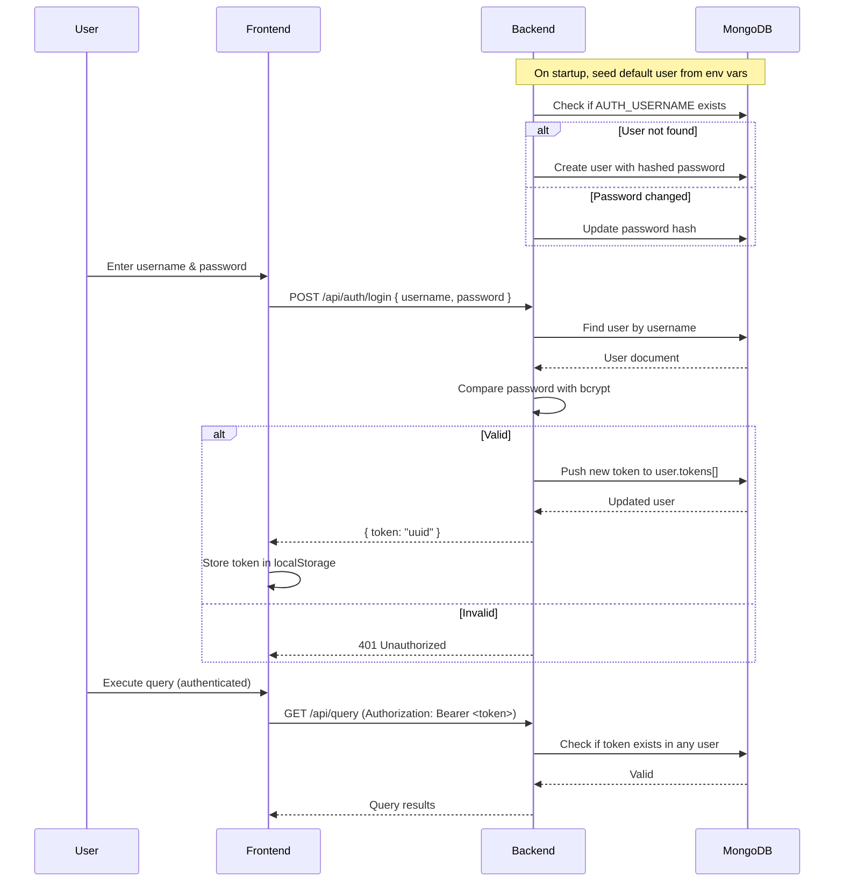

# Authentication — BQ Viewer

## Overview

BQ Viewer uses **username/password authentication** with tokens stored in MongoDB.

Unlike the previous hardcoded `AUTH_PASSWORD` approach, credentials are now stored in the `authentications` collection in MongoDB. This allows multiple users and proper session management.

---

## How It Works



---

## API Endpoints

### `POST /api/auth/login`

Authenticate with username and password.

**Request:**

```json
{
  "username": "admin",
  "password": "your-password"
}
```

**Response (200):**

```json
{
  "token": "550e8400-e29b-41d4-a716-446655440000"
}
```

**Response (401):**

```json
{
  "message": "Invalid username or password",
  "error": "Unauthorized",
  "statusCode": 401
}
```

### `POST /api/auth/logout`

Invalidate the current bearer token.

**Headers:**

```
Authorization: Bearer <token>
```

**Response (200):**

```json
{
  "success": true
}
```

---

## Database Schema

Collection: `authentications`

```javascript
{
  _id: ObjectId,
  username: "admin",              // unique
  passwordHash: "$2a$10$...",     // bcrypt hash
  tokens: [
    {
      token: "uuid-string",
      createdAt: ISODate("2026-07-13T...")
    }
  ],
  createdAt: ISODate("2026-07-13T..."),
  updatedAt: ISODate("2026-07-13T...")
}
```

---

## Environment Variables

| Variable        | Wajib | Deskripsi                                     |
| --------------- | ----- | --------------------------------------------- |
| `AUTH_USERNAME` | ✅    | Username untuk default admin user             |
| `AUTH_PASSWORD` | ✅    | Password (plain text — akan di-hash otomatis) |

### Setup

Set both variables in your environment (or `.env` file):

```bash
AUTH_USERNAME=admin
AUTH_PASSWORD=your-password-here
```

> **Catatan:** `AUTH_PASSWORD` sekarang **plain text**, bukan bcrypt hash. Aplikasi akan meng-hash password secara otomatis saat pertama kali di-seed ke database.

---

## Auto-Seed Behavior

Saat backend pertama kali dijalankan:

1. Cek apakah user dengan `AUTH_USERNAME` sudah ada di database
2. Jika **belum ada**: buat user baru dengan bcrypt hash dari `AUTH_PASSWORD`
3. Jika **sudah ada** tapi password berubah (env var berbeda): update hash password
4. Jika **sudah ada** dan password sama: lewati (no-op)

Ini memudahkan deployment — cukup set `AUTH_USERNAME` dan `AUTH_PASSWORD` di Coolify / Docker, dan user akan dibuat otomatis.

---

## Frontend

### Login Page

The login form now includes both **Username** and **Password** fields:

```tsx
// LoginPage.tsx
const [username, setUsername] = useState("");
const [password, setPassword] = useState("");

const handleSubmit = async (e: FormEvent) => {
  // POST /api/auth/login with { username, password }
};
```

### Token Management

Token tetap disimpan di `localStorage` dengan key `bq_viewer_auth_token`:

- `setToken(token)` — simpan token setelah login sukses
- `getToken()` — ambil token untuk dikirim sebagai Bearer header
- `clearToken()` — hapus token saat logout / unauthorized

---

## Security Considerations

1. **Password hashing**: Menggunakan `bcryptjs` dengan salt rounds 10 saat menyimpan ke database
2. **Token generation**: Menggunakan `crypto.randomUUID()` untuk token yang tidak bisa ditebak
3. **Token storage**: Token disimpan di MongoDB sebagai array di dokumen user
4. **Transport security**: Gunakan HTTPS di production (via Coolify / reverse proxy)
5. **No password exposure**: Password tidak pernah dikembalikan dalam response API (field `passwordHash` di-exclude via Mongoose `toJSON` transform)
