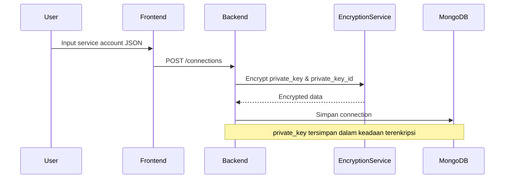
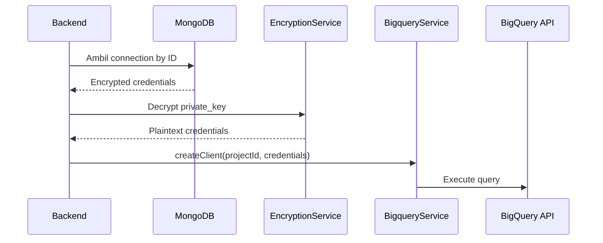
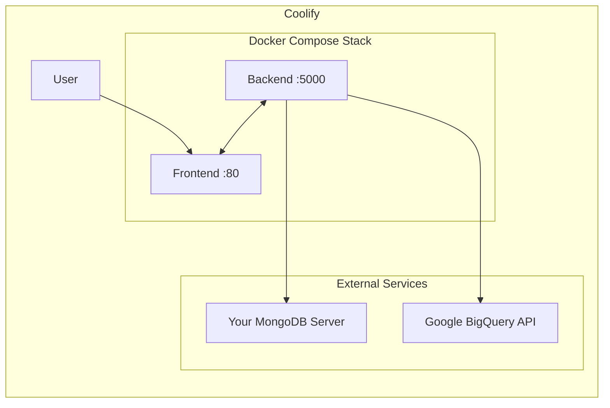

# Deploy BQ Viewer ke Coolify

## Prerequisites

- Coolify instance (self-hosted atau cloud)
- **MongoDB server** sendiri (Atlas, DigitalOcean, atau self-hosted)
- Service Account Google Cloud Platform (GCP) dengan akses BigQuery
- Domain (opsional, untuk HTTPS)

## Opsi Deploy

Karena `be-bq-viewer` dan `fe-bq-viewer` adalah **dua repo GitHub terpisah**, ada 2 opsi deploy:

---

## Opsi 1: Docker Compose Stack (Rekomendasi)

Kedua repo tetap terpisah, tetapi image di-push ke **Docker Hub** via GitHub Actions.
Cukup deploy `fe-bq-viewer` sebagai **Docker Compose** resource di Coolify — file `docker-compose.coolify.yml` sudah tersedia di repo tersebut.

### 1. Setup GitHub Actions di masing-masing repo

Workflow GitHub Actions **sudah tersedia** di masing-masing repo:

- `be-bq-viewer/.github/workflows/docker-publish.yml`
- `fe-bq-viewer/.github/workflows/docker-publish.yml`

```yaml
name: Build & Push Backend

on:
  push:
    branches: [main, master]
    tags: ["v*"]
  pull_request:
    branches: [main, master]

env:
  REGISTRY: docker.io
  IMAGE_NAME: ${{ secrets.DOCKER_USERNAME }}/be-bq-viewer

jobs:
  build-and-push:
    runs-on: ubuntu-latest
    permissions:
      contents: read

    steps:
      - name: Checkout repository
        uses: actions/checkout@v4

      - name: Set up Docker Buildx
        uses: docker/setup-buildx-action@v3

      - name: Log into Docker Hub
        if: github.event_name != 'pull_request'
        uses: docker/login-action@v3
        with:
          registry: ${{ env.REGISTRY }}
          username: ${{ secrets.DOCKER_USERNAME }}
          password: ${{ secrets.DOCKER_PASSWORD }}

      - name: Extract Docker metadata
        id: meta
        uses: docker/metadata-action@v5
        with:
          images: ${{ env.IMAGE_NAME }}
          tags: |
            type=raw,value=latest,enable={{is_default_branch}}
            type=semver,pattern={{version}}
            type=semver,pattern={{major}}.{{minor}}
            type=sha,prefix=,suffix=,format=short

      - name: Build and push
        uses: docker/build-push-action@v6
        with:
          context: .
          push: ${{ github.event_name != 'pull_request' }}
          tags: ${{ steps.meta.outputs.tags }}
          labels: ${{ steps.meta.outputs.labels }}
          cache-from: type=gha
          cache-to: type=gha,mode=max
```

> **Prasyarat:** Set **GitHub Secrets** di masing-masing repo:
>
> - `DOCKER_USERNAME` — username Docker Hub Anda
> - `DOCKER_PASSWORD` — password atau access token Docker Hub
>
> Setelah di-push ke `main`, image akan otomatis terbuild dan ter-push ke:
>
> - `docker.io/<username>/be-bq-viewer:latest`
> - `docker.io/<username>/fe-bq-viewer:latest`

### 2. Deploy docker-compose.coolify.yml ke Coolify

File `docker-compose.coolify.yml` sudah tersedia di repo `fe-bq-viewer`. File ini menggunakan **pre-built images dari Docker Hub**:

```yaml
name: bq-viewer

services:
  backend:
    image: ${DOCKER_USERNAME}/be-bq-viewer:latest
    container_name: be-bq-viewer
    ports:
      - "${BACKEND_PORT:-5000}:5000"
    environment:
      - PORT=5000
      - NODE_ENV=production
      - MONGODB_URI=${MONGODB_URI}
      - ENCRYPTION_KEY=${ENCRYPTION_KEY}
      - AUTH_PASSWORD=${AUTH_PASSWORD}
    restart: unless-stopped
    networks:
      - bq-viewer-network

  frontend:
    image: ${DOCKER_USERNAME}/fe-bq-viewer:latest
    container_name: fe-bq-viewer
    ports:
      - "${FRONTEND_PORT:-80}:80"
    environment:
      - PORT=80
      - BACKEND_HOST=backend
      - BACKEND_PORT=5000
    depends_on:
      - backend
    restart: unless-stopped
    networks:
      - bq-viewer-network

networks:
  bq-viewer-network:
    driver: bridge
```

### 3. Deploy di Coolify

1. Buka Coolify dashboard
2. **Resources** → **New Resource** → **Docker Compose**
3. Pilih repo `maulananizhar/fe-bq-viewer`
4. **Build Pack**: `docker-compose`
5. **Compose File**: `docker-compose.coolify.yml`
6. Set **Environment Variables** (lihat tabel di bawah):

   | Variable          | Wajib | Contoh / Petunjuk                 |
   | ----------------- | ----- | --------------------------------- |
   | `DOCKER_USERNAME` | ✅    | Username Docker Hub Anda          |
   | `MONGODB_URI`     | ✅    | Connection string MongoDB Anda    |
   | `ENCRYPTION_KEY`  | ✅    | `openssl rand -base64 64`         |
   | `AUTH_USERNAME`   | ✅    | Username untuk login              |
   | `AUTH_PASSWORD`   | ✅    | Password untuk login (plain text) |

7. Deploy!

> **Catatan:** Image akan di-pull dari Docker Hub. Pastikan image sudah ter-push (via GitHub Actions) sebelum deploy.

---

## Opsi 2: Deploy Terpisah

Deploy backend dan frontend sebagai service terpisah di Coolify.

### Backend

1. **New Resource** → **Public Repository**
2. Pilih repo `maulananizhar/be-bq-viewer`
3. **Build Pack**: `Dockerfile`
4. **Port**: `5000`
5. Set environment variables (lihat tabel)
6. Deploy

### Frontend

1. **New Resource** → **Public Repository**
2. Pilih repo `maulananizhar/fe-bq-viewer`
3. **Build Pack**: `Dockerfile`
4. **Port**: `80`
5. Set environment variables:

| Variable       | Value                            |
| -------------- | -------------------------------- |
| `PORT`         | `80`                             |
| `BACKEND_HOST` | (IP/domain backend dari Coolify) |
| `BACKEND_PORT` | `5000`                           |

6. Deploy

---

## Troubleshooting

## Environment Variables

### Backend — wajib diisi

| Variable         | Wajib | Deskripsi                                                            |
| ---------------- | ----- | -------------------------------------------------------------------- |
| `MONGODB_URI`    | ✅    | Connection string MongoDB Anda sendiri                               |
| `ENCRYPTION_KEY` | ✅    | Key enkripsi 64-byte base64. Generate via: `openssl rand -base64 64` |
| `AUTH_USERNAME`  | ✅    | Username untuk login                                                 |
| `AUTH_PASSWORD`  | ✅    | Password untuk login (plain text — akan di-hash otomatis)            |
| `NODE_ENV`       | ❌    | Default: `production`                                                |
| `PORT`           | ❌    | Default: `5000`                                                      |

#### Health Check Endpoint

Backend menyediakan endpoint `GET /api/health` yang digunakan oleh Docker healthcheck:

```
GET /api/health
Response: { "status": "ok" }
```

- **Tidak memerlukan autentikasi** (dijaga oleh `@Public()` decorator)
- Digunakan oleh Docker/Coolify untuk memverifikasi container berjalan dengan benar
- Jika endpoint ini tidak dapat diakses, container akan ditandai sebagai **unhealthy**

#### Cara set AUTH_USERNAME dan AUTH_PASSWORD

Cukup set **plain text** username dan password di environment variable.
Aplikasi akan meng-hash password secara otomatis dan menyimpannya ke MongoDB.

```bash
AUTH_USERNAME=admin
AUTH_PASSWORD=password-anda
```

### Frontend

| Variable       | Wajib | Deskripsi                               |
| -------------- | ----- | --------------------------------------- |
| `PORT`         | ❌    | Default: `80`                           |
| `BACKEND_HOST` | ✅    | Hostname backend (nama service atau IP) |
| `BACKEND_PORT` | ❌    | Default: `5000`                         |

---

## Service Account GCP via MongoDB

Akses BigQuery **tidak** menggunakan file JSON service account yang di-mount. Sebaliknya, credentials GCP (service account JSON) disimpan langsung di **MongoDB** melalui fitur **Connections** di aplikasi.

Flow penyimpanan:



Saat digunakan untuk query:



> **Tidak perlu** mount file JSON service account. Cukup buat Connection baru melalui UI aplikasi.

---

## Network

Backend dan frontend harus bisa saling berkomunikasi.

- **Docker Compose**: otomatis dalam satu network `bq-viewer-network`
- **Deploy terpisah**: set `BACKEND_HOST` ke IP internal backend (Coolify akan memberikan internal domain seperti `be-bq-viewer.<uuid>.coolify.internal`)

---

## Diagram Alur



---

## Troubleshooting

| Masalah                          | Solusi                                                  |
| -------------------------------- | ------------------------------------------------------- |
| Backend tidak bisa konek MongoDB | Periksa `MONGODB_URI`, pastikan IP Coolify di-whitelist |
| 502 Bad Gateway dari frontend    | Pastikan `BACKEND_HOST` dan `BACKEND_PORT` benar        |
| 401 Unauthorized terus           | Regenerate bcrypt hash untuk `AUTH_PASSWORD`            |
| Container restart loop           | Cek log Coolify — biasanya error environment variable   |
